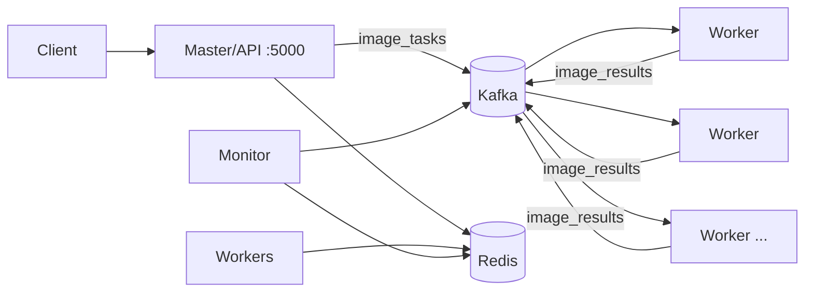

# Distributed Image Processing System

Flask master/API service that splits large images into tiles, Kafka workers that
apply transformations in parallel, and Redis for job and worker state.

## Architecture



The master validates and stores an upload, splits it into 512x512 JPEG tiles,
and publishes the existing `image_tasks` messages with keys in the form
`job_id:tile_id:transformation`. Workers consume from the shared
`image_workers` group, process tiles with OpenCV, and publish JPEG results to
`image_results` using `job_id:tile_id` keys. The master reconstructs the image
after all tiles arrive. Worker heartbeats use `worker_heartbeats` and Redis TTLs.

## Local Setup

Requirements: Docker Desktop with the Linux engine running, Docker Compose, and
an image at least 1024x1024. No AWS account or credentials are needed.

```bash
docker compose up --build
```

Open <http://localhost:5000>. Compose starts Kafka in single-node KRaft mode,
creates the three existing topics, starts Redis, the master, a monitor, and one
worker. Kafka and Redis are reachable only on the internal Compose network.

```bash
docker compose down
docker compose down -v  # also remove the local master data volume
```

## Environment Variables

`.env.example` contains placeholders and local Compose values. Copy it to
`.env` only when you need overrides; `.env` is ignored by git.

| Variable | Default outside Compose | Purpose |
|---|---|---|
| `KAFKA_BROKER` | `localhost:9092` | Kafka bootstrap address |
| `REDIS_HOST` | `localhost` | Redis hostname |
| `REDIS_PORT` | `6379` | Redis port |
| `FLASK_PORT` | `5000` | Master HTTP port |
| `STORAGE_ROOT` | repository directory | Local upload/result/tile root |
| `DEPENDENCY_RETRY_SECONDS` | `3` | Retry delay while Redis is starting |

Compose overrides `KAFKA_BROKER` to `kafka:9092`, `REDIS_HOST` to `redis`, and
`STORAGE_ROOT` to `/data`. Use service names inside containers, not `localhost`.

## API Usage

The web UI is available at `/`. The same flow can be called directly:

```bash
curl -F "file=@sample.jpg" -F "transformation=grayscale" http://localhost:5000/upload
curl http://localhost:5000/status/<job_id>
curl -o result.jpg http://localhost:5000/result/<job_id>
curl http://localhost:5000/health
```

Supported transformations are `grayscale` and `blur`. The dashboard is at
`/dashboard`.

## Scaling Workers Locally

Workers use one shared Kafka consumer group, so each tile is assigned to one
worker. Start more worker containers with:

```bash
docker compose up --build --scale worker=3
```

Each replica uses its Compose hostname as its worker ID. The `image_tasks`
topic currently has two partitions, so more than two active consumers will not
increase task parallelism until the topic is recreated with more partitions.

## Failure Handling

- Master and workers retry Redis connections while dependencies start.
- Kafka clients continue polling through transient broker errors; Compose also
  restarts workers and the monitor if their process exits.
- With current auto-commit behavior, a worker stopped after a commit can lose a
  task. Stronger at-least-once processing is a later improvement.
- Stopping one worker leaves remaining workers consuming from the shared group.
- Redis and Kafka remain internal and are not published to the host.

## AWS DEPLOYMENT

The same Docker image can later run on EC2 without changing the application.
This phase does not provision AWS resources.

### EC2 preparation

1. Create private VPC/subnet placement and install Docker Engine and the Compose
   plugin on the EC2 host(s).
2. Copy the repository to the master host, or build/push the image to a private
   registry and pull it on the host.
3. Supply environment variables for private Kafka and Redis DNS names or
   private IPs. Never put credentials in source, `.env.example`, or an image.
4. Run `docker compose up -d` after adapting deployment environment values and
   service placement.

### Network and service placement

- Allow TCP `5000` only from intended clients or a load balancer.
- Allow Kafka `9092` and Redis `6379` only between master, workers, monitor,
  and private data hosts. Never expose either service publicly.
- A first deployment can keep all services on one EC2 instance. Later, workers
  can run on separate instances with the same image and private
  `KAFKA_BROKER`/`REDIS_HOST` values.
- If Kafka or Redis becomes AWS-managed, use its private endpoint and add the
  provider's required TLS/authentication client settings.

### Storage migration

Local Compose stores uploads, results, and temporary tiles under the persistent
`master-data` volume. `storage.py` is the storage boundary. An S3 implementation
can replace `LocalStorage` for durable uploads/results without changing Kafka
keys or worker processing. Use an EC2 role or a secret manager for AWS access;
do not commit access keys.

## Current Local vs Future AWS-Managed Components

| Component | Current local setup | Possible AWS setup later |
|---|---|---|
| Master/API and workers | Docker Compose containers | EC2 containers, workers on separate instances |
| Kafka | Apache Kafka single-node KRaft container | Private Kafka cluster or Amazon MSK |
| Redis | Redis container | ElastiCache for Redis or private Redis host |
| Image storage | Persistent Docker volume | S3 through the storage adapter |
| Monitoring | `monitor.py` and Docker logs | CloudWatch/log aggregation |

Existing topic names and Kafka message formats are preserved.