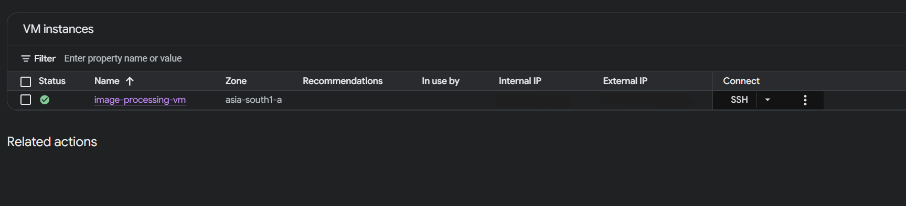
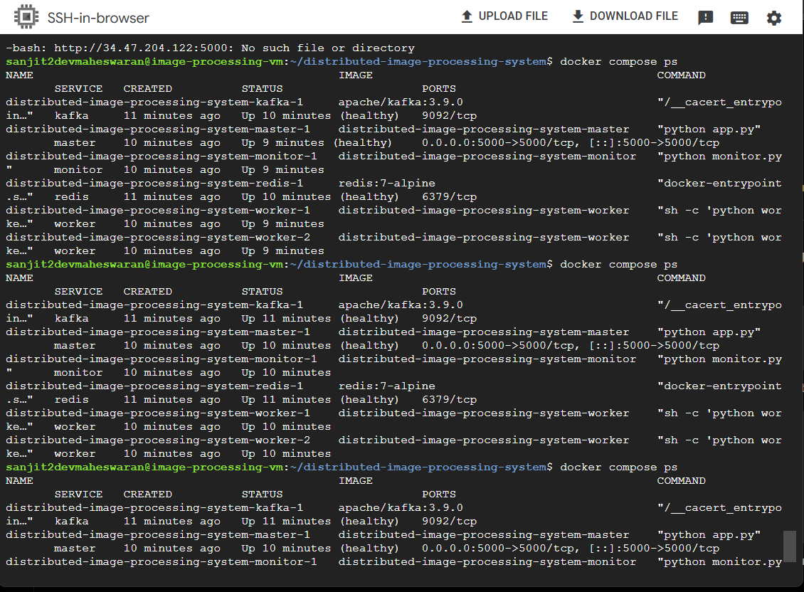
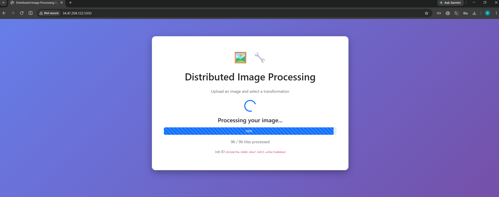

# Distributed Image Processing System

A scalable, fault-tolerant distributed image-processing system that parallelizes image transformations across multiple worker processes using **Apache Kafka** for asynchronous task distribution and **Redis** for shared state management.

The system uses a **Master-Worker architecture** where the Master handles client requests and coordinates processing, while multiple workers process image tiles concurrently.

---

## 🚀 Features

- Distributed image processing using parallel workers
- Apache Kafka for asynchronous task distribution
- Redis for shared job state management
- Dockerized deployment using Docker Compose
- Centralized Flask-based web interface
- Automatic image tiling for large images
- Parallel processing across multiple workers
- Worker health monitoring using heartbeats
- Fault-tolerant task execution
- Support for Grayscale and Blur transformations
- Google Cloud Compute Engine deployment

---

## 🛠️ Technology Stack

| Category | Technology |
|----------|------------|
| Language | Python 3.10+ |
| Web Framework | Flask |
| Message Broker | Apache Kafka |
| State Management | Redis |
| Image Processing | OpenCV, NumPy, Pillow |
| Containerization | Docker, Docker Compose |
| Cloud Platform | Google Cloud Compute Engine |

---

# 🏗️ System Architecture

The system follows a **Master-Worker architecture**.

```text
                         Client
                           │
                           ▼
                  ┌─────────────────┐
                  │   Flask Master  │
                  │    Web / API    │
                  └────────┬────────┘
                           │
                           ▼
                  ┌─────────────────┐
                  │      Kafka      │
                  │   Task Broker   │
                  └────────┬────────┘
                           │
                    Task Distribution
                           │
              ┌────────────┴────────────┐
              │                         │
              ▼                         ▼
      ┌───────────────┐        ┌───────────────┐
      │    Worker 1   │        │    Worker 2   │
      │               │        │               │
      │ OpenCV        │        │ OpenCV        │
      │ Processing     │        │ Processing    │
      └───────┬───────┘        └───────┬───────┘
              │                         │
              └────────────┬────────────┘
                           │
                           ▼
                  ┌─────────────────┐
                  │      Redis      │
                  │   Shared State  │
                  └────────┬────────┘
                           │
                           ▼
                  ┌─────────────────┐
                  │  Master / API   │
                  │ Reconstructs    │
                  │ Final Image     │
                  └─────────────────┘
```

---

# 🔄 How It Works

### 1. Image Upload

The user uploads an image through the Flask web interface.

### 2. Image Tiling

For large images, the Master divides the image into smaller **512 × 512 tiles**.

This allows different portions of the image to be processed independently.

### 3. Task Distribution

Each tile becomes a processing task.

The Master publishes these tasks to **Apache Kafka**.

### 4. Parallel Processing

Multiple workers consume tasks from Kafka and process image tiles concurrently.

Supported transformations include:

- Grayscale
- Blur

Image processing is performed using OpenCV and related Python libraries.

### 5. State Management

**Redis** is used to maintain shared job and processing state.

This allows the Master and workers to coordinate the progress of image-processing jobs.

### 6. Result Reconstruction

After all tiles have been processed, the Master collects the results and reconstructs the final image.

### 7. Worker Monitoring

Workers periodically send heartbeat information.

The monitoring component uses these heartbeats to determine whether workers are alive and available.

---

# 📁 Project Structure

```text
.
├── app.py
├── worker.py
├── monitor.py
├── setup_kafka.py
├── requirements.txt
├── Dockerfile
├── docker-compose.yml
└── ...
```

### Main Components

| Component | Responsibility |
|-----------|----------------|
| `app.py` | Flask web interface and API |
| `worker.py` | Processes image-processing tasks |
| `monitor.py` | Monitors worker health |
| `setup_kafka.py` | Kafka/topic initialization |
| `Dockerfile` | Container image configuration |
| `docker-compose.yml` | Multi-service orchestration |

---

# ⚙️ Getting Started

## Prerequisites

Install the following:

- Python 3.10+
- Git
- Docker
- Docker Compose

You do **not** need ZeroTier for the Docker-based deployment.

---

# 💻 Local Installation

Clone the repository:

```bash
git clone <REPOSITORY_URL>
cd bd_project
```

Build and start the application:

```bash
docker compose up -d --build
```

Check the running services:

```bash
docker compose ps
```

You should see the application services running, including:

- Kafka
- Redis
- Master
- Monitor
- Workers

---

# ▶️ Running the Application

After the containers have started, open:

```text
http://localhost:5000
```

This opens the image-processing web interface.

---

# 🖼️ Using the Application

### Step 1 — Upload an Image

Select an image from your computer through the web interface.

For large images, the system automatically divides the image into smaller tiles.

### Step 2 — Select a Transformation

Choose one of the available transformations:

- Grayscale
- Blur

### Step 3 — Start Processing

Submit the image for processing.

The Master creates the required processing tasks and publishes them to Kafka.

### Step 4 — Distributed Processing

Kafka distributes the tasks among the available workers.

```text
              Image
                │
                ▼
          Master / Flask
                │
                ▼
        Split into tiles
                │
                ▼
             Kafka
          ┌─────┴─────┐
          ▼           ▼
      Worker 1     Worker 2
          │           │
          └─────┬─────┘
                ▼
             Redis
                │
                ▼
       Reconstruct image
                │
                ▼
          Final Result
```

The workers process different image tiles concurrently.

### Step 5 — Download the Result

Once processing is complete, the reconstructed image can be downloaded through the application.

---

# 📊 Monitoring Dashboard

The application provides a worker monitoring dashboard.

Open:

```text
http://localhost:5000/dashboard
```

The dashboard can be used to check worker availability and processing information.

Workers periodically send heartbeat signals to indicate that they are alive.

---

# ❤️ Health Check

The application provides a health endpoint:

```text
http://localhost:5000/health
```

Example response:

```json
{
  "kafka": "ok",
  "redis": "ok",
  "status": "ok"
}
```

This endpoint can be used to verify that the application and its Kafka/Redis dependencies are available.

---

# 🔌 API Endpoints

| Method | Endpoint | Description |
|--------|----------|-------------|
| `GET` | `/` | Opens the web interface |
| `GET` | `/health` | Checks application, Kafka and Redis health |
| `GET` | `/dashboard` | Displays worker monitoring information |
| `POST` | `/upload` | Uploads an image for processing |
| `GET` | `/status/<job_id>` | Checks the status of a processing job |
| `GET` | `/result/<job_id>` | Retrieves the processed image |

> Endpoint behavior may depend on the current application configuration.

---

# 🐳 Docker

The application is containerized to provide a reproducible deployment environment.

Start the complete system:

```bash
docker compose up -d --build
```

Check containers:

```bash
docker compose ps
```

View Master logs:

```bash
docker compose logs -f master
```

View Worker logs:

```bash
docker compose logs -f worker
```

Stop the application:

```bash
docker compose down
```

To remove containers, networks, and associated Compose resources:

```bash
docker compose down -v
```

---

# ☁️ Google Cloud Deployment

The system was deployed on **Google Cloud Compute Engine** using Docker Compose.

The cloud deployment runs the distributed components as containerized services on a Compute Engine VM.

```text
              Google Cloud
          Compute Engine VM
                  │
       ┌──────────┼──────────┐
       │          │          │
       ▼          ▼          ▼
    Flask       Kafka      Redis
    Master
       │
       ▼
   ┌─────────┐
   │ Workers │
   │         │
   │ Worker 1│
   │ Worker 2│
   └─────────┘
```

### Cloud Deployment Stack

- Google Cloud Compute Engine
- Ubuntu
- Docker
- Docker Compose
- Apache Kafka
- Redis
- Flask
- Multiple worker containers

The application is exposed through the Flask service, while Kafka and Redis remain internal to the deployment.

---

# 📸 Deployment Screenshots

## Google Cloud Compute Engine

The application was deployed on a Google Cloud Compute Engine VM.



---

## Docker Services

The distributed services run as Docker containers.



---

## Image Processing

Example of the application processing an image.



---

## Worker Monitoring

The dashboard provides visibility into worker health and processing status.


---

# 🔍 Fault Tolerance & Monitoring

The system is designed to improve reliability through distributed processing and worker monitoring.

### Worker Heartbeats

Workers periodically send heartbeat information to indicate that they are active.

### Distributed Processing

Image-processing tasks are distributed through Kafka rather than being processed entirely by a single worker.

### Shared State

Redis provides shared state management for tracking processing jobs and their progress.

### Tile Processing

Large images are divided into smaller tiles so that processing can be distributed across multiple workers.

### Cleanup

Temporary image tiles are cleaned up after successful processing.

---

# 🧪 Example Workflow

A typical processing workflow looks like:

```text
1. User uploads image
          │
          ▼
2. Flask receives request
          │
          ▼
3. Image is divided into tiles
          │
          ▼
4. Tasks published to Kafka
          │
          ▼
5. Workers consume tasks
          │
          ▼
6. Workers apply transformation
          │
          ▼
7. Results stored/tracked
          │
          ▼
8. Master collects results
          │
          ▼
9. Image reconstructed
          │
          ▼
10. User downloads result
```

---

# 🛑 Stopping the System

To stop the application:

```bash
docker compose down
```

To stop and remove the Compose volumes:

```bash
docker compose down -v
```

---

# 👥 Development

The project was originally developed as a distributed multi-node system with separate broker, master, and worker nodes.

The current Docker-based deployment packages these distributed components into reproducible containerized services and was deployed on Google Cloud Compute Engine.

---

# 📌 Notes

- Large images are automatically divided into smaller tiles.
- Workers process tiles concurrently.
- Kafka handles asynchronous task distribution.
- Redis manages shared processing state.
- Worker heartbeats are used for health monitoring.
- Docker Compose manages the distributed services.
- The cloud deployment uses Google Cloud Compute Engine.
